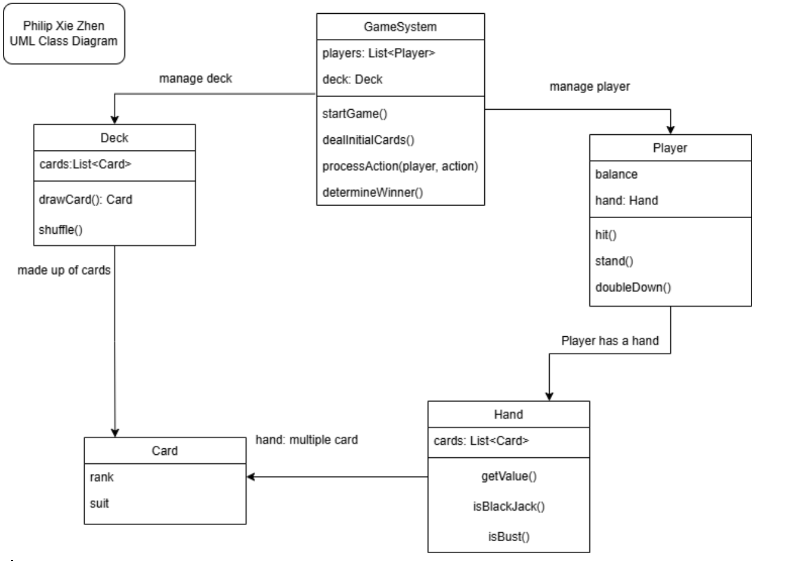

# Fullerton Funhouse Blackjack Game

## Subtitle: A fun, modern video game version of the classic card game Blackjack.

## Project Description:
This project is all about creating a fun and easy-to-play video game version of Blackjack. We'll start by building the Blackjack game and then make it better based on what players like. Our aim is to make a game that's exciting and simple to update.

Below is a UML sequence diagram that shows how the Blackjack game works. It explains the steps from dealing the cards to finding out who wins.

*UML class diagram*

- The Dealer deals one card face up to both the Player and themselves, followed by a second face-up card to the Player and a face-down card to themselves.  
- The Player’s turn begins, where they can request additional cards (hit) until they choose to stand or bust (exceed a total of 21, resulting in a loss of their bet).  
- If the Player stands, the Dealer reveals their hidden card and draws cards until their total is 17 or higher.  
- The game concludes with outcomes: if the Dealer busts (total > 21), remaining players win; if the Dealer’s total is 21 or higher, the Dealer wins. Postconditions state that card values are known, hands are dealt, and a winner is decided.

## StyleGuide:
**Linter:** ESLint for JavaScript  
**Code Formatting Rules:**  
- Use 2 spaces for indentation  
- Use camelCase for naming variables and functions  
- No spaces around parentheses in function calls and declarations  
- One space after commas in arrays or objects  